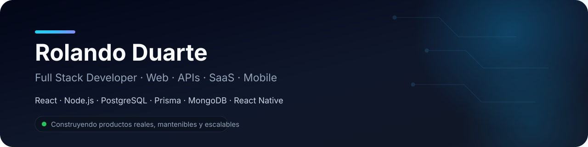

<div align="center">



<br />

[](https://portfolio-rolando-du.vercel.app/)
[](https://github.com/Rolando-Du)
[](mailto:rolandoduarte83@gmail.com)


</div>

---

## 👨‍💻 Perfil profesional

Soy **Full Stack Developer** orientado a construir productos digitales completos: frontend moderno, APIs REST, sistemas empresariales, plataformas SaaS, dashboards, mapas y aplicaciones móviles.

Trabajo con una visión de producto de punta a punta: **arquitectura, desarrollo, datos, seguridad, documentación, pruebas técnicas y deployment**. Priorizo soluciones claras, mantenibles y preparadas para crecer.

```text
Frontend        React · Vite · Tailwind CSS · JavaScript · TypeScript
Backend         Node.js · Express · FastAPI · REST APIs · JWT · Swagger
Datos           PostgreSQL · Prisma · MongoDB · Mongoose · SQLite
Mobile          React Native · Expo
Mapas           Leaflet · MapLibre · geolocalización · rutas · heatmaps
DevOps          Git · GitHub · Docker · Vercel · Render
```

---

## 🚀 Proyectos destacados

<table>
<tr>
<td width="50%" valign="top">

### ✈️ Registro de Vuelos

**Aplicación full stack** para registrar y administrar movimientos operativos de vuelos.

- Login y registro
- JWT y rutas protegidas
- Arribos y partidas
- Búsquedas específicas
- Dashboard de actividad
- Persistencia MongoDB

**Stack:** React · Vite · Tailwind CSS · Node.js · Express · MongoDB

[](https://github.com/Rolando-Du/psa-vuelos-sistema)

</td>
<td width="50%" valign="top">

### 🛡️ SIGEP — Sistema Integral de Gestión de Equipamiento y Personal

**Aplicación web** para la gestión logística de personal, equipamiento, stock, asignaciones y devoluciones.

- Gestión de personal y estados
- Control de equipamiento individual y por cantidad
- Asignación permanente y temporaria de elementos
- Gestión y control de equipamiento
- Control de stock e inventario
- Historial de movimientos y asignaciones
- Registro de entregas y devoluciones
- Impresión y exportación a PDF
- Login de administrador con JWT
- PostgreSQL + Prisma
- Backend protegido con autenticación

**Stack:** React · Vite · Tailwind CSS · Node.js · Express · PostgreSQL · Prisma · JWT

[](https://github.com/Rolando-Du/sigep)

</td>
</tr>

<tr>
<td width="50%" valign="top">

### 🛡️ Sistema de Seguridad

**Plataforma full stack** para gestión, análisis y visualización territorial de incidentes.

- Dashboard operativo
- Mapas y heatmaps
- Bases operativas
- Reportes y exportación CSV
- Roles ADMIN / OPERADOR / LECTOR
- Auditoría de acciones

**Stack:** React · Vite · Node.js · Express · PostgreSQL · Prisma · Leaflet

[](https://sistema-seguridad-six.vercel.app)
[](https://github.com/Rolando-Du/sistema-seguridad)

</td>
<td width="50%" valign="top">

### 🌐 Epulen

**Aplicación web** desarrollada con enfoque en experiencia de usuario, diseño responsive y arquitectura moderna de frontend.

- Diseño responsive
- Interfaz moderna
- Componentes reutilizables
- Navegación optimizada
- Experiencia de usuario (UX/UI)

**Stack:** React · Vite · Tailwind CSS

[](https://epulen.vercel.app/)
[](https://github.com/Rolando-Du/Epulen)

</td>
</tr>

<tr>
<td width="50%" valign="top">

### 🧩 NexoCore

**SaaS empresarial modular** para gestión de clientes, operaciones, evidencias, notificaciones y auditoría.

- Arquitectura multi-tenant
- Roles y permisos
- Autenticación JWT
- Auditoría y notificaciones
- PostgreSQL + Prisma
- Swagger / OpenAPI

**Stack:** React · Node.js · Express · PostgreSQL · Prisma

[](https://github.com/Rolando-Du/NexoCore)

</td>
<td width="50%" valign="top">

### 🌿 CLEARZONE Environment

**Aplicación mobile + backend** para monitoreo ambiental, calidad del aire, clima, rutas y seguimiento en tiempo real.

- Datos AQI reales
- Clima actual
- Geolocalización
- MapLibre + OpenFreeMap
- Rutas con OpenRouteService
- APK Android con EAS Build

**Stack:** React Native · Expo · TypeScript · Node.js · Prisma · PostgreSQL

[](https://github.com/Rolando-Du/phoenix-environment)

</td>
</tr>

<tr>
<td width="50%" valign="top">

### 🏪 Sistema Kiosco

**Sistema de gestión comercial** para kiosco, librería e impresiones.

- Productos y stock
- Ventas POS
- Caja diaria
- Compras
- Proveedores
- Historial y reportes

**Stack:** React · Vite · Tailwind CSS · FastAPI · SQLAlchemy · SQLite

[](https://github.com/Rolando-Du/SistemaKiosco)

</td>
<td width="50%" valign="top">

### 💻 Otros proyectos

Desarrollo continuo de aplicaciones web, sistemas de gestión y soluciones full stack.

- Aplicaciones web
- Sistemas de gestión
- APIs REST
- Dashboards
- Autenticación y autorización
- Bases de datos
- Integraciones y servicios externos

**Stack:** React · Node.js · Express · PostgreSQL · MongoDB · Prisma · Tailwind CSS

</td>
</tr>
</table>

---

## 🛠️ Tecnologías

### Frontend

<p>
  
</p>

### Backend & APIs

<p>
  
</p>

### Bases de datos

<p>
  
</p>

### Herramientas & Deployment

<p>
  
</p>

---

## 🧠 Qué puedo construir

| Área | Experiencia aplicada |
|---|---|
| **SaaS** | Multi-tenant, roles, permisos, auditoría y módulos empresariales |
| **APIs REST** | Autenticación, validaciones, servicios, documentación y seguridad |
| **Dashboards** | Métricas, filtros, reportes, gráficos y exportación |
| **Mapas** | Geolocalización, heatmaps, rutas, tracking y puntos operativos |
| **Mobile** | React Native + Expo + APIs nativas |
| **Datos** | PostgreSQL, Prisma, MongoDB, modelado y persistencia |
| **Deploy** | Vercel, Render, Docker y entornos de producción |

---

## 🧱 Cómo trabajo

```text
Problema real
    ↓
Análisis funcional
    ↓
Arquitectura y modelo de datos
    ↓
API / Backend
    ↓
Frontend o Mobile
    ↓
Seguridad y validaciones
    ↓
Documentación
    ↓
Lint / Build / pruebas técnicas
    ↓
GitHub + Deployment
```

Principios que mantengo en mis proyectos:

- separación clara de responsabilidades;
- componentes y servicios reutilizables;
- APIs fáciles de probar y documentar;
- autenticación y autorización cuando corresponde;
- secretos fuera del repositorio;
- interfaces responsive;
- Git como parte del flujo diario;
- documentación pensada para mantenimiento y evolución.

---

## 📊 GitHub

<div align="center">


<br />


</div>

> Las estadísticas reflejan los repositorios públicos y no equivalen por sí solas al nivel de experiencia en cada tecnología.

---

## 🎯 Enfoque actual

Actualmente profundizo especialmente en:

- productos SaaS y arquitecturas multi-tenant;
- React y frontend moderno;
- Node.js, Express y APIs REST;
- PostgreSQL + Prisma;
- React Native + Expo;
- mapas, geolocalización y datos territoriales;
- automatización e integraciones externas;
- seguridad, documentación y deployment.

---

## 🤝 Contacto

<div align="center">

¿Querés conocer mis proyectos o conversar sobre desarrollo de software?

<br />

[](https://portfolio-rolando-du.vercel.app/)
[](mailto:rolandoduarte83@gmail.com)
[](https://github.com/Rolando-Du)

<br />

**Construir · Aprender · Mejorar · Repetir**

</div>
